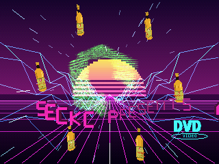
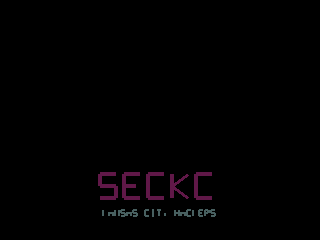

# SecKC // PSX

A demoscene production for the **original PlayStation**, themed around
[SecKC](https://www.seckc.org) — Kansas City's longest-running monthly hacker
meetup. Built with [PSn00bSDK](https://github.com/Lameguy64/PSn00bSDK), it boots
from a real PS1 disc image and runs on actual hardware, the
[MiSTer FPGA](https://github.com/MiSTer-devel) PSX core, or any emulator.



### ▶ [Play it in your browser](https://pecord.github.io/seckc-cracktro/)

No download, no BIOS — it runs on a WebAssembly PlayStation core (pcsx_rearmed +
[OpenBIOS](https://github.com/grumpycoders/pcsx-redux)) via
[Nostalgist.js](https://nostalgist.js.org/).

> Built as a **learning project**: the source is small, commented, and split into
> one module per effect so it's easy to fork and read. Start with
> [ARCHITECTURE.md](ARCHITECTURE.md) for a tour of the frame and how each piece
> works.

## What's in it

A synthwave scene at 60fps:

- **A synthwave soundtrack** on **CD-DA**, with the visuals reacting to it: the
  skull pulses to a **VU level** read from the live CD play position each frame
  (`audio.c`). The source tree builds an original, all-synthesized track via
  `tools/make_music.py`.
- **A scrolling neon grid + banded sun** — the classic outrun horizon, a
  perspective floor grid, and a wireframe **heightmap canyon** that rushes toward
  the camera so it feels like driving through it (`backdrop.c`).
- **The SecKC ASCII skull** — the group's logo baked to a green-phosphor texture
  and rendered as a spinning, **extruded 3D slab** (`logo.c`). The centrepiece.
- **A chrome sphere** — a GTE environment-mapped ball using a synthwave matcap
  keyed by screen-space position, so the reflection stays world-anchored as the
  surface spins. A live-reflection experiment is available behind a `PERF_*`
  toggle, but the default keeps the demo at 60fps (`sphere.c`).
- **A bouncing DVD-screensaver logo**, flipping to a new neon colour on every
  wall hit (`logo.c`).
- **A 3D perspective scroller** of greetz — solid filled 3D text on a wave,
  carrying SecKC's creed (*"Destroy No Data / Maintain No Persistence / Above All
  Else Do No Harm"*) and shout-outs to the KC scene (`text.c`).
- **Framebuffer feedback trails** — the previous frame is lightly re-drawn over
  the current one for neon afterimages (`gpu.c`).
- **A custom boot splash** and a warp starfield.



## Source layout

Immediate-mode rendering, one module per concern. Full tour in
[ARCHITECTURE.md](ARCHITECTURE.md).

| File | What it does |
|------|--------------|
| `main.c`      | entry point, boot splash, the per-frame loop |
| `config.h`    | screen/OT constants and the `PERF_*` feature toggles |
| `gpu.c`       | double buffer, ordering table, primitive + colour helpers |
| `audio.c`     | CD-DA soundtrack + the music-reactive VU level |
| `backdrop.c`  | synthwave grid, sun, starfield |
| `logo.c`      | SecKC skull slab + DVD bouncer |
| `text.c`      | vector-font labels + the scroller |
| `sphere.c`    | the environment-mapped chrome ball |
| `vecfont.h`   | a tiny stroke (vector) font |

## Build

Requires [PSn00bSDK](https://github.com/Lameguy64/PSn00bSDK) and a
`mipsel-none-elf` GCC toolchain. With those installed:

```sh
export PSN00BSDK_LIBS=/path/to/psn00bsdk/lib/libpsn00b
export PATH=/path/to/mipsel-none-elf/bin:$PATH

python3 tools/make_music.py        # generates music.wav (needs numpy)
python3 tools/make_loop.py         # trims it to a short seamless CD-DA loop
cmake --preset default
cmake --build build
```

This produces `build/rave.bin` + `build/rave.cue` (a PS1 disc image with the
CD-DA audio track) and `build/rave.exe` (a raw PS-EXE).

Reflection study builds are available as presets. The most practical one is the
60fps patched-live mode:

```sh
cmake --preset live-reflection-lite
cmake --build --preset live-reflection-lite
BUILD_DIR=$PWD/build-live-reflection-lite RENDER_OUT=/tmp/rave-live.png tools/render.sh
```

Use `full-reflection` if you want the exact two-pass version for comparison; it
is slower.

The music is **not** checked in (it's large) — generate it with
`tools/make_music.py` (needs `numpy`) before the first build; it's deterministic.
Textures (`seckc.tim`, `dvd.tim`) are checked in but can be regenerated with
`tools/make_tex.py` / `tools/make_dvd.py` (need Pillow). The VU envelope
(`vu_env.h`) is regenerated from the loop with `tools/make_vu.py`.

## Run

- **Emulator** — open `build/rave.cue` in DuckStation or PCSX-Redux. A PS1 BIOS
  is required (not included). `tools/render.sh` rebuilds, boots DuckStation, and
  captures the render window to `/tmp/rave.png` for quick visual checks.
- **MiSTer** — copy `rave.cue` + `rave.bin` to the SD card and load it in the
  PlayStation core.
- `run.sh` builds and launches it in DuckStation on macOS.

## Credits

- **SecKC** — the name, skull/"faceoff" logo, ASCII art, and creed.
  [seckc.org](https://www.seckc.org) · [github.com/SecKC](https://github.com/SecKC).
  This is an unofficial fan tribute.
- **PSn00bSDK** — Lameguy64 & spicyjpeg. MPL-2.0.
- Greetz to DC816, Cowtown Computer Congress, BSidesKC, Hammerspace, and the
  Knuckleheads.

## License

MIT (see [LICENSE](LICENSE)). SecKC branding belongs to SecKC; PSn00bSDK is MPL-2.0.
