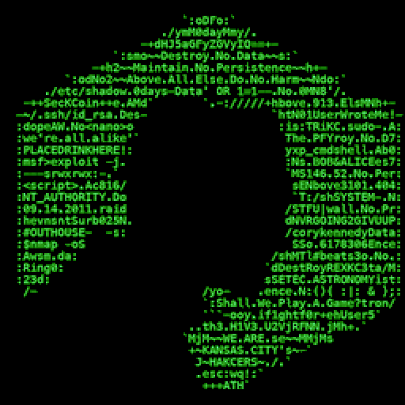
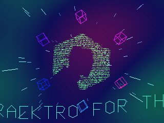
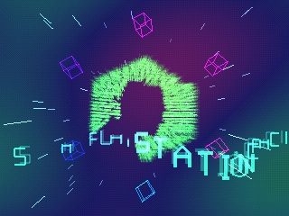

# SecKC Cracktro (PSX)

A 90s/2000s-style demoscene **cracktro for the original PlayStation**, themed
around [SecKC](https://www.seckc.org) — Kansas City's longest-running monthly
hacker meetup. Built with [PSn00bSDK](https://github.com/Lameguy64/PSn00bSDK),
it boots from a real PS1 disc image and runs on actual hardware, the
[MiSTer FPGA](https://github.com/MiSTer-devel) PSX core, or any emulator.


## What's in it

- **A real fixed-point raytracer** as the backdrop — analytic ray/sphere
  intersection, a perspective checker floor, Lambert + specular shading, and a
  one-bounce floor reflection. No FPU, no GTE: pure 16.16 fixed point with an
  integer sqrt, rendered to a small texture and upscaled. (Yes, a raytracer. On
  a 33 MHz R3000.)
- **The SecKC ASCII skull** — the group's logo (a skull built from hacker ASCII)
  baked to a green-phosphor texture and rendered as a spinning, **extruded 3D
  slab** that tumbles over the scene.
- **A 3D perspective sine-scroller** of greetz — solid filled 3D text on a wave,
  carrying SecKC's creed (*"Destroy No Data / Maintain No Persistence / Above All
  Else Do No Harm"*) and shout-outs to the KC scene.
- Additive-glow neon wireframe cubes, a warp starfield, and a 110 BPM beat clock
  driving the pulses.

| ASCII skull texture | Extruded skull | 3D filled scroller |
|---|---|---|
|  |  |  |

## Performance notes

It's a fill-rate and CPU balancing act. A few tricks that keep it moving:

- The camera, floor, and sky are static, so per-pixel **ray directions, floor
  hit distances, and the background colour are all precomputed once**. Most
  pixels are a straight table copy each frame.
- The moving sphere is **screen-space bounding-box culled** — only pixels inside
  its projected rectangle run the intersection test.
- `isqrt` is 32-bit (no slow 64-bit ops), the sphere normal uses a precomputed
  reciprocal-radius multiply instead of a divide, and the 128-wide RT texture is
  drawn as two 64-wide 16-bit pages (no palette rewrite).

See `main.c` — `rt_render()` and `ray_init()`.

## Build

Requires [PSn00bSDK](https://github.com/Lameguy64/PSn00bSDK) and a
`mipsel-none-elf` GCC toolchain. With those installed:

```sh
export PSN00BSDK_LIBS=/path/to/psn00bsdk/lib/libpsn00b
export PATH=/path/to/mipsel-none-elf/bin:$PATH

cmake --preset default
cmake --build build
```

This produces `build/rave.bin` + `build/rave.cue` (a PS1 disc image) and
`build/rave.exe` (a raw PS-EXE).

The SecKC skull texture (`seckc.tim`) is checked in, but you can regenerate it
from the ASCII art with `tools/make_tex.py` (needs Python + Pillow).

## Run

- **Emulator** — open `build/rave.cue` in DuckStation or PCSX-Redux. A PS1 BIOS
  is required (not included). `tools/render.sh` does a headless screenshot via
  PCSX-Redux + OpenBIOS.
- **MiSTer** — copy `rave.cue` + `rave.bin` to the SD card and load it in the
  PlayStation core.
- `run.sh` builds and launches it in DuckStation on macOS.

## Credits

- **SecKC** — the name, skull/"faceoff" logo, ASCII art, and creed.
  [seckc.org](https://www.seckc.org) · [github.com/SecKC](https://github.com/SecKC).
  This is an unofficial fan tribute.
- **PSn00bSDK** — Lameguy64 & spicyjpeg. MPL-2.0.
- Greetz to DC816, Cowtown Computer Congress, BSidesKC, Hammerspace, and the
  Knuckleheads.

## License

MIT (see [LICENSE](LICENSE)). SecKC branding belongs to SecKC; PSn00bSDK is MPL-2.0.
